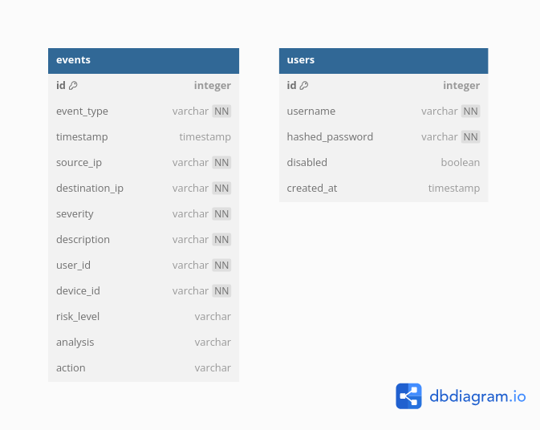

📚 Database Schema Documentation

## Overview

Our project utilizes PostgreSQL as the relational database management system (RDBMS) in conjunction with SQLAlchemy ORM for database interactions. The primary models defined are:

- **User**: Represents the user accounts in the system.
- **Event**: Captures and stores various security-related events.

For a visual representation of the database structure, refer to the Entity-Relationship Diagram (ERD).

---

🗃️ **Tables**

1. **User**

   | Column           | Data Type | Constraints                  | Description                              |
   |------------------|-----------|------------------------------|------------------------------------------|
   | `id`             | Integer   | Primary Key, Indexed         | Unique identifier for each user.         |
   | `username`       | String    | Unique, Not Null, Indexed    | Unique username for user authentication. |
   | `hashed_password`| String    | Not Null                     | Hashed password for securing user access.|
   | `disabled`       | Boolean   | Default: False               | Indicates if the user account is active. |
   | `created_at`     | DateTime  | Default: Current Timestamp   | Timestamp when the user account was created.|

   **Model Definition:**
   ```python
   op.create_table('users',
       sa.Column('id', sa.Integer(), nullable=False),
       sa.Column('username', sa.String(), nullable=False),
       sa.Column('hashed_password', sa.String(), nullable=False),
       sa.Column('disabled', sa.Boolean(), nullable=True),
       sa.Column('created_at', sa.DateTime(), nullable=True),
       sa.PrimaryKeyConstraint('id')
   )
   sa.Index('ix_users_id', 'users', ['id'], unique=False)
   sa.Index('ix_users_username', 'users', ['username'], unique=True)
   ```

2. **Event**

   | Column          | Data Type | Constraints                  | Description                                                  |
   |-----------------|-----------|------------------------------|--------------------------------------------------------------|
   | `id`            | Integer   | Primary Key, Indexed         | Unique identifier for each event.                           |
   | `event_type`    | String    | Not Null, Indexed            | Type of the security event (e.g., login_attempt, firewall_alert). |
   | `timestamp`     | DateTime  | Default: Current Timestamp   | Time when the event occurred.                                |
   | `source_ip`     | String    | Not Null                     | IP address where the event originated.                       |
   | `destination_ip`| String    | Not Null                     | IP address targeted by the event.                            |
   | `severity`      | String    | Not Null                     | Severity level of the event (e.g., low, medium, high).       |
   | `description`   | String    | Not Null                     | Detailed description of the event.                           |
   | `user_id`       | Integer   | Not Null, Foreign Key        | Identifier of the user associated with the event.            |
   | `device_id`     | String    | Not Null                     | Identifier of the device associated with the event.          |
   | `risk_level`    | String    | Nullable                     | Assessed risk level of the event.                            |
   | `analysis`      | String    | Nullable                     | Analysis results of the event.                               |
   | `action`        | String    | Nullable                     | Action taken in response to the event.                        |

   **Model Definition:**
   ```python
   op.create_table('events',
       sa.Column('id', sa.Integer(), nullable=False),
       sa.Column('event_type', sa.String(), nullable=False),
       sa.Column('timestamp', sa.DateTime(), nullable=True),
       sa.Column('source_ip', sa.String(), nullable=False),
       sa.Column('destination_ip', sa.String(), nullable=False),
       sa.Column('severity', sa.String(), nullable=False),
       sa.Column('description', sa.String(), nullable=False),
       sa.Column('user_id', sa.Integer(), sa.ForeignKey('users.id'), nullable=False),
       sa.Column('device_id', sa.String(), nullable=False),
       sa.Column('risk_level', sa.String(), nullable=True),
       sa.Column('analysis', sa.String(), nullable=True),
       sa.Column('action', sa.String(), nullable=True),
       sa.PrimaryKeyConstraint('id')
   )
   sa.Index('ix_events_event_type', 'events', ['event_type'], unique=False)
   sa.Index('ix_events_id', 'events', ['id'], unique=False)
   ```

---

📈 **Entity-Relationship Diagram (ERD)**

An Entity-Relationship Diagram (ERD) provides a visual representation of the database schema, illustrating the relationships between different tables.

> **Figure:** ERD depicting the relationship between User and Event tables.
>
> 
>
> **Note:** You can generate an ERD using tools like dbdiagram.io, Lucidchart, or DrawSQL. After creating the diagram, save it as `erd.png` and place it in the `docs/` directory.

---

🌐 **Relationships**

**User ↔ Event**

- **One-to-Many Relationship:** A single user can be associated with multiple events.
- **Foreign Key Constraint:** The `Event` table's `user_id` references the `User` table's `id` to enforce referential integrity.

**Example Implementation with Foreign Key:**
